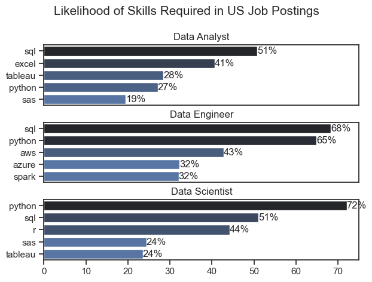

# The Analysis

## 1. What are the most demanded skills for the most popular data roles?

To find the most demanded skills for the top 3 most popular data roles in 2023. I filtered out those positions by which ones were the most popular, and got the top 5 skills for these top roles. These visualizations highlight the most popular job titles and their top skills, showing which skills I should pay attention to depending on the role I'm looking for. 

View my notebook with detailed steps here: [2_Skills_Count.ipynb](2_Skills_Count.ipynb)

### Visualize Data


```python
    for i, job_title in enumerate(job_titles): #looping through each job title
        df_plot = df_skills_perc[df_skills_perc['job_title_short'] == job_title].head(5) #filtering for only that job title
    
        sns.barplot(data=df_plot, x='skill_percent', y='job_skills', ax=ax[i], hue='skill_count', palette='dark:b_r', legend=False)
    plt.show()
```
### Results



### Insights

- Python is a highly versatile skill that is prominent across all job roles, but mostly for Data Engineers (65%) and Scientists (72%)
- SQL is the most highly requested skill for Data Analysts (51%) and Engineers (68%)
- Data Engineers require more specialized skills (AWS, Azure, Spark) compared to the other 2 roles. Data Scientists seem to lean more towards general data management and analysis tools (Tableau, SQL).