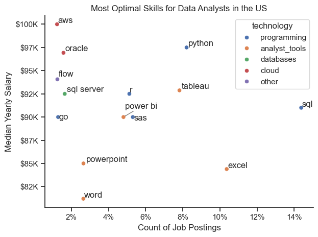

# The Analysis

## Exploratory Data Analysis
View my notebook with detailed steps here:
[Exploratory_Data_Analysis.ipynb](1_Exploratory_Data_Analysis_Intro.ipynb)


### Visualize Data
```python
#for top 10 locations
sns.set_theme(style='ticks') #dims color to make it more paleatable 
sns.barplot(data=df_plot, x='count', y='job_location', hue='count', palette='dark:b_r', legend=False) #hue creates gradient based on number of counts
sns.despine() #removes top and right spines from plot
plt.title('Top 10 Job Locations By Number of Job Postings')
plt.xlabel('Number of Job Postings')
plt.ylabel('Job Locations')
plt.show()

fig, ax = plt.subplots(1,3)
dict_column = {
    'job_work_from_home': 'Work from Home',
    'job_no_degree_mention': 'Degree Requirement',
    'job_health_insurance': 'Health Insurance Offered' #dictionary of columns in df to titles for each corresponding pie chart
}
# for pie charts
for i, (column, title) in enumerate(dict_column.items()): #loop through each column and title in dictionary
   ax[i].pie(df[column].value_counts(), startangle=90, autopct='%1.1f%%', labels=['False', 'True'])
   ax[i].set_title(title)
   
fig.tight_layout()   
plt.show()
# for top 10 companies
df_plot = df_DA_US['company_name'].value_counts().head(10).to_frame() #creating a df to plot top 10 companies

sns.set_theme(style='ticks') #dims color to make it more paleatable 
sns.barplot(data=df_plot, x='count', y='company_name', hue='count', palette='dark:b_r', legend=False) #hue creates gradient based on number of counts
sns.despine() #removes top and right spines from plot
plt.title('Top 10 Companies By Number of Job Postings')
plt.xlabel('Number of Job Postings')
plt.ylabel('Companies')
plt.show()

```


## 1. What are the most demanded skills for the most popular data roles? 

View my notebook with detailed steps here: [2_Skills_Count.ipynb](2_Skills_Count.ipynb)

### Visualize Data


```python
    for i, job_title in enumerate(job_titles): #looping through each job title
        df_plot = df_skills_perc[df_skills_perc['job_title_short'] == job_title].head(5) #filtering for only that job title
    
        sns.barplot(data=df_plot, x='skill_percent', y='job_skills', ax=ax[i], hue='skill_count', palette='dark:b_r', legend=False)
    plt.show()
```
### Results


### Insights

- Python is a highly versatile skill that is prominent across all job roles, but mostly for Data Engineers (65%) and Scientists (72%)
- SQL is the most highly requested skill for Data Analysts (51%) and Engineers (68%)
- Data Engineers require more specialized skills (AWS, Azure, Spark) compared to the other 2 roles. Data Scientists seem to lean more towards general data management and analysis tools (Tableau, SQL).

## 2. How Are In-Demand Skills Trending for Data Analysts?

View my notebook with detailed steps here: [3_Skills_Trend.ipynb](3_Skills_Trend.ipynb)
### Visualize Data

```python
df_top_5 = df_percent.iloc[:,:5] #choosing top 5 skills
fig, ax = plt.subplots()
sns.lineplot(data=df_top_5, dashes=False, palette='tab10')
ax.yaxis.set_major_formatter(plt.FuncFormatter(lambda y, pos: f'{y:.0f}%'))
plt.show()
```

### Results


### Insights

- SQL remains as the most popular skills, but interestingly, it has shown a gradual decline through the year of 2023.
- Excel remains the second most popular skill, mostly staying steady until August, where it declines by almost 10% through November.
- Python and Tableau show very similar behavior and likelihood throughout the year, except in August, where Python has a sharp but short-lived increase.

## 3. How Well do Jobs and Skills Pay for Data Analysts?

### Salary Analysis for Data Related Roles

View my notebook for detailed steps here: [4_Salary_Analysis.ipynb](4_Salary_Analysis.ipynb)

```python
#######for the box plot visualization#######
sns.boxplot(data=df_US_top_6, x='salary_year_avg', y='job_title_short', order=job_order) 
ax = plt.gca()
ax.xaxis.set_major_formatter(plt.FuncFormatter(lambda x, pos: f'${int(x/1000)}K'))
ax.set_xlabel('Yearly Median Salary')
ax.set_ylabel('')
plt.title('Median Salary Analysis for Data Related Roles')
plt.show()

#####for the bar charts########
fig, ax = plt.subplots(2,1)
sns.set_theme(style='ticks')
sns.barplot(data=df_DA_top_pay, x='median', y=df_DA_top_pay.index, ax=ax[0], hue='median', palette='dark:b_r') #plotting highest paying skills
sns.barplot(data=df_skills, x='median', y=df_skills.index, ax=ax[1], hue='median', palette='light:b') #plotting top 10 most frequent skills
plt.show()
```
## Visualize Data


## Insights

- Overall, as one moves higher in seniority, the median salary increases. The one interesting exception is Senior Data Analyst, which is lower than Data Engineer or Scientist. This implies that instead of trying to move to the senior counterpart to one's role, it is wiser to instead shift to a Data Engineer or Scientist position. 

-  As one gets more experience and specializes, this box plot also indicates a trend towards the right. The Senior Data Engineer and Scientist roles had the most variability, which makes sense as one could imagine that the flexibility and requirement of a broad array of skills is necessary to succeed in these roles.


## Insights

- We can see that advanced, niche skills like dplyr, bitbucket, and gitlab correspond to the highest median salaries. Interestingly, these are also skills with some of the lowest counts, which probably contributes to its high salary, since these skills are not very likely to be commonly found in candidates.

- Very foundational skills like Tableau, SQL and Excel are very commonly found, but represent some of the skills with a corresponding lower median pay. Even though the salaries might be low, it pays to have expertise of these foundational skills, and they should not be neglected for skills with high salaries, especially at the start of one's career.

- Knowing programming languages or having knowledge in visualization software will bring one closer to the higher end of the median salary range, as seen in the second chart. It highlights the importance of knowing programming languages if one wants to advance in their career.

## 4. What Are The Most Optimal Skills for Data Analysts?

```python
from adjustText import adjust_text
sns.scatterplot(
    data=df_plot, 
    x='skill_percent',
    y='median_salary',
    hue='technology'
    )
sns.set_theme(style='ticks')
sns.despine()
plt.tight_layout()
plt.show()
```
View my notebook for detailed steps here: 
[5_Optimal_Skills.ipynb](5_Optimal_Skills.ipynb)

## Results



## Insights

- The programming skills tend to stay in the higher
paying regions($90k - $97k), meanwhile their likelihood of being in a given job posting highly varies.

- Analyst tools (colored orange) are quite common, showing that visualization and foundational data analysis software is still very needed and crucial in data roles. Overall, however, their median salaries are quite low.

- In summary, having experience with programming and analyst tools seems to be the perfect combination to maximize both likelihood in showing up in job postings and having a higher salary. 


